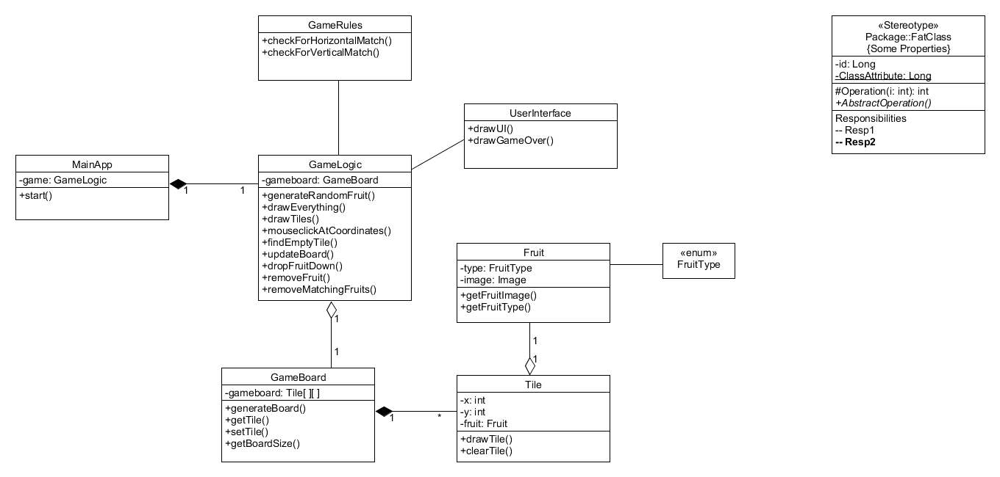

# Aiheen kuvaus

##Aihe: 
Himmun Hedelmäpeli on bejeweled-tyylinen peli, jossa pelaaja yrittää saada kolme samanlaista hedelmää pystysuoraan tai vaakasuoraan riviin pelikentällä. Pelikenttä on täynnä satunnaisia hedelmiä. Pelaaja voi syödä ohjaamallaan dinosauruksella kentältä hedelmiä, jolloin syödyn hedelmän yläpuoliset hedelmät tipahtavat alaspäin. Kun pelaaja saa kolme samanlaista hedelmää riviin, ne katoavat kentältä ja pelaaja saa pisteitä. Pelaajalla on rajallinen määrä syöntikertoja, ja hänen täytyy saada tarpeeksi pisteitä päästäkseen kentän läpi.

##Pelaajan toimintoja:
* pelaaja voi aloittaa uuden pelin
* pelaaja voi syödä kentältä yksittäisen hedelmän
* pelaaja voi lopettaa pelin kesken
* ...

##Luokkakaavio

