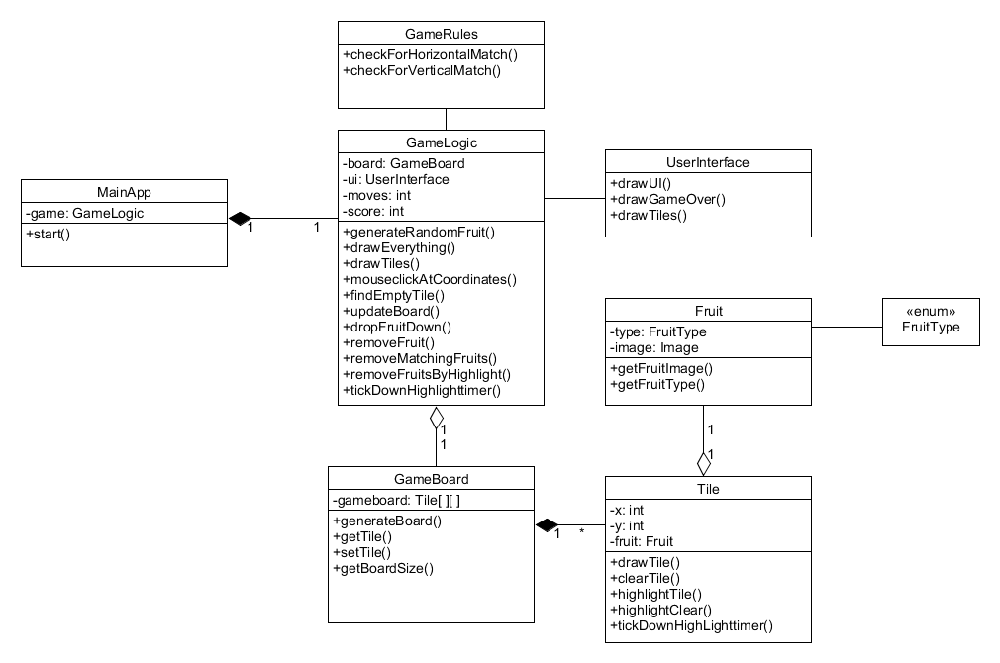

# Aiheen kuvaus

##Aihe: 
Himmun Hedelmäpelissä pelaaja yrittää saada vähintään kolme samanlaista hedelmää pystysuoraan tai vaakasuoraan riviin pelikentällä. Pelikenttä on täynnä satunnaisia hedelmiä. Pelaaja voi syödä hiirellä klikkaamalla kentältä hedelmän, jolloin syödyn hedelmän yläpuolella olevat hedelmät tipahtavat alaspäin. Kun pelaaja saa kolme tai useamman samanlaista hedelmää riviin, ne katoavat kentältä ja pelaaja saa pisteitä. Pelaajalla on rajallinen määrä syöntikertoja.

##Käyttötapauksia:
* Pelaaja syö kentältä hedelmän, hedelmä poistuu
* Pelaaja saa kolme tai useamman hedelmää riviin, pelaaja saa pisteitä
* Pelaajan siirrot loppuvat, peli loppuu

##Luokkakaavio

##Sekvenssikaavioita

###Pelaaja klikkaa hedelmää kentällä

###Pelaajan viimeinen siirto

###Kentän päivittävä looppi

##Rakennekuvaus
Pelini rakenne on varsin yksinkertainen: ohjelma rakentuu MainAppin lisäksi kahdesta logiikkaluokasta ja neljästä peliobjektiluokasta sekä käyttöliittymäluokasta. Pelilogiikkaluokalla on pelikenttä, joka koostuu ruuduista (Tile), jotka puolestaan voivat olla tyhjiä tai sisältää hedelmän. Hedelmiä on viisi erilaista, ja niiden määrää on tarvittaessa helppo lisätä, koska hedelmätyypit on tallennettu FruitType-enumeraattoriin.

GameLogic-luokka hoitaa suurimman osan pelin varsinaisesta logiikasta. Se mm. asettaa pelikentän pelin alussa täyteen satunnaisia hedelmiä ja poistaa hedelmän kun sitä klikataan - eli merkitsee hedelmän poistettavaksi ja hetken päästä poistaa sen. GameLogic myös etsii ja täyttää tyhjät ruudut: joko pudottamalla tyhjän ruudun yläpuolisia hedelmiä alaspäin tai jos yläpuolella ei ole hedelmiä, arpomalla uudet hedelmät. Tyhjiä ruutuja voi syntyä kahdella eri tavalla: pelaaja klikkaa hedelmää, jolloin se katoaa, tai pelaaja saa tarpeeksi monta samanlaista hedelmää riviin, jolloin pelilogiikka poistaa ne ja antaa pelaajalle pisteitä. Jotta pelaaja ehtisi paremmin nähdä, mitä pelikentällä tapahtuu, tyhjiä ruutuja ei visuaalisesti täytetä aivan heti, vaan pienellä viiveellä. Varsinainen samanlaisten hedelmien matchien etsiminen on GameRules-luokan metodien tehtävä: luokassa on erikseen metodi vaakasuuntaiselle ja pystysuuntaiselle matchille.

UserInterFace-luokka puolestaan hoitaa UI:n sekä pelin loppuruudun piirtämisen, ja sen drawTiles-metodi käy läpi pelikentän ruudut ja käskee niitä piirtää itsensä.

MainApp pyörittää JavaFX-pelilooppia ja hoitaa myös hiirenkuuntelijan. Pelilooppi pyörii 60 kertaa sekunnissa, tai ainakin mahdollisimman lähellä tätä nopeutta. Pelilooppi käskee UserInterFacea piirtämään tarvittavat asiat näytölle (drawThings) sekä käsittelee hiiren klikkaukset (handleUserInput) ja käskee pelilogiikkaa päivittää pelikentän (updateBoard). Hiirenkuuntelija tallettaa hiiren klikkaukset stackiin. Stacki on oikeastaan väärässä järjestyksessä koska uusin klikkaus on päällimmäisenä, mutta tämä ei ole ongelma, koska ainakin periaatteessa stackia puretaan 60 kertaa sekunnissa. On hyvin epätodennäköistä, että pelaaja onnistuu saamaan stackiin enemmän kuin yhden klikkauksen, etenkin, kun hiirellä kliksuttelu ei vaikuta pelikenttään silloin kun kentällä on putoamisvaiheessa olevia hedelmiä.

